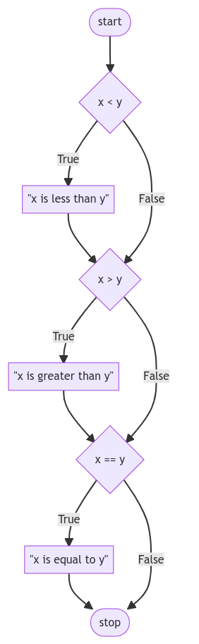
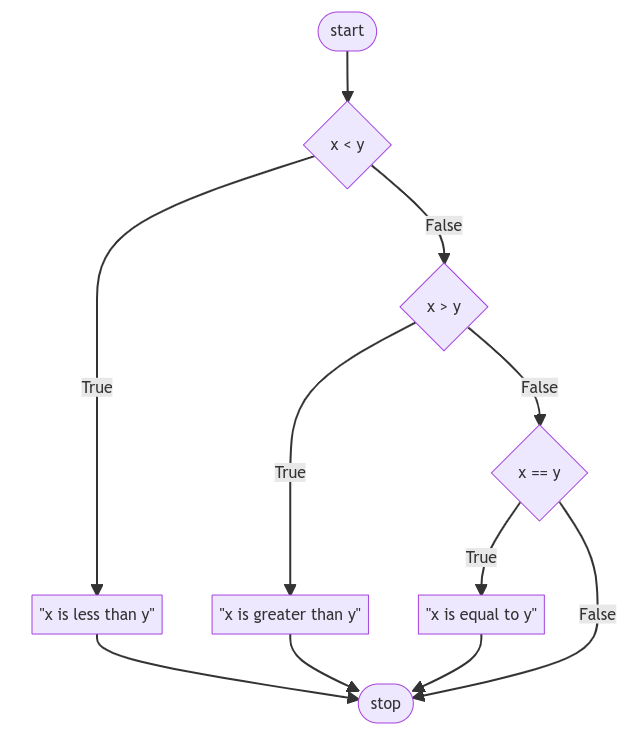
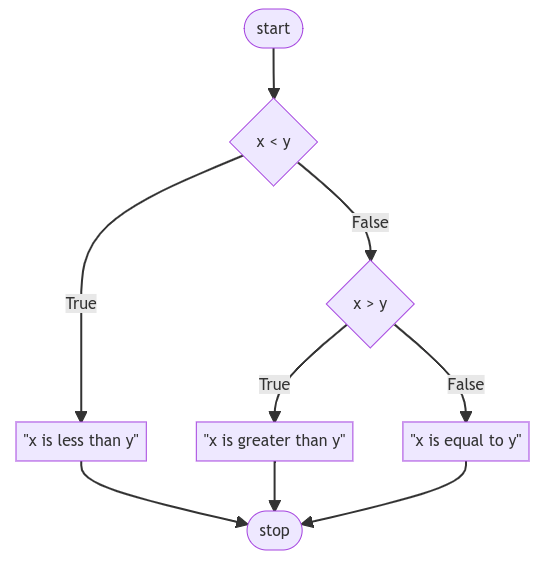
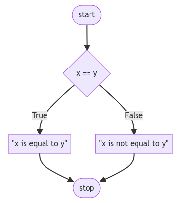

# Módulo 2: Lógica de Programação Algorítmica com Java

## Aula 1: Estruturas de Decisão (Condicionais)

Você agora tem o poder em Java de usar instruções condicionais para fazer perguntas e permitir que seu programa tome ações de acordo. Nesta aula, discutiremos...

- Instruções `if`;
- Fluxo de controle;
- Operador OR `||`;
- Operador AND `&&`;
- Módulo;
- Criar sua própria função.

## Condicionais

- Condicionais permitem que você, o programador, faça seu programa tomar decisões: Como se seu programa tivesse a escolha entre seguir o caminho da esquerda ou o caminho da direita com base em certas condições.
- Embutidos em Java estão um conjunto de "operadores" usados para fazer perguntas matemáticas.
- Os símbolos `>` e `<` são provavelmente bastante familiares para você.
- `>=` denota "maior ou igual a".
- `<=` denota "menor ou igual a".
- `==` denota "igual a", mas note o duplo sinal de igual! Um único sinal de igual atribuiria um valor. Os sinais de igual duplo são usados para comparar variáveis.
- `!=` denota "diferente de".
- Instruções condicionais comparam um termo à esquerda com um termo à direita.

## Instruções If

- Na sua janela do terminal, digite `code Compare.java`. Isso criará um novo arquivo chamado “Compare.java” no VS Code.
- Na janela do editor de texto, comece com o seguinte:

    ```
    public class Compare {
        public static void main(String[] args) {
            Scanner sc = new Scanner(System.in);

            System.out.println("Qual é o valor de x? ");
            int x = sc.nextInt();

            System.out.println("Qual é o valor de y? ");
            int y = sc.nextInt();

            sc.close();

            if (x < y) {
                System.out.print("x é menor que y");
            }
        }
    }
    ```

  Note como seu programa recebe a entrada do usuário para x e y, convertendo-os em inteiros e salvando-os em suas respectivas variáveis x e y. Em seguida, a instrução `if` compara x e y. Se a condição de `x < y` for atendida, a instrução `print` será executada.

- Instruções `if` usam valores `boolean` (`true` ou `false`) para decidir se devem ou não ser executadas. Se a instrução `x > y` for verdadeira, o compilador a registrará como `true` e executará o código.

## Fluxo de Controle

- Revise seu código da seguinte maneira:

    ```
    public class Compare {
        public static void main(String[] args) {
            Scanner sc = new Scanner(System.in);

            System.out.println("Qual é o valor de x? ");
            int x = sc.nextInt();

            System.out.println("Qual é o valor de y? ");
            int y = sc.nextInt();

            sc.close();

            if (x < y) {
                System.out.print("x é menor que y");
            } else if (x > y) {
                System.out.print("x é maior que y");
            } else if (x == y) {
                System.out.print("x é igual a y");
            }
        }
    }
    ```

  Note como você está fornecendo uma série de instruções `if`. Primeiro, a primeira instrução `if` é avaliada. Em seguida, a segunda instrução `if` executa sua avaliação. Finalmente, a última instrução `if` executa sua avaliação. Este fluxo de decisões é chamado de "fluxo de controle".

- Nosso código pode ser representado da seguinte forma:

  <div align="center">
    
  </div>
  </br>

- Este programa pode ser melhorado ao não fazer três perguntas consecutivas. Afinal, não é possível que todas as três perguntas tenham um resultado verdadeiro! Revise seu programa da seguinte maneira:

    ```
    public class Compare {
        public static void main(String[] args) {
            Scanner sc = new Scanner(System.in);

            System.out.println("Qual é o valor de x? ");
            int x = sc.nextInt();

            System.out.println("Qual é o valor de y? ");
            int y = sc.nextInt();

            sc.close();

            if (x < y) {
                System.out.print("x é menor que y");
            } else if (x > y) {
                System.out.print("x é maior que y");
            } else if (x == y) {
                System.out.print("x é igual a y");
            }
        }
    }
    ```

  Note como o uso de `else if` permite que o programa tome menos decisões. Primeiro, a instrução `if` é avaliada. Se essa instrução for considerada verdadeira, todas as instruções `else if` não serão executadas. No entanto, se a instrução `if` for avaliada e considerada falsa, o primeiro `else if` será avaliado. Se for verdadeiro, não executará a avaliação final.

- Nosso código pode ser representado da seguinte forma:

<div align="center">
  
</div>
</br>

- Embora seu computador possa não notar uma diferença na velocidade entre nosso primeiro programa e este programa revisado, considere como um servidor online executando bilhões ou trilhões desses tipos de cálculos a cada dia poderia definitivamente ser impactado por uma pequena decisão de codificação como essa.
- Há uma última melhoria que podemos fazer em nosso programa. Note como logicamente `else if (x == y)` não é uma avaliação necessária a ser executada. Afinal, se logicamente x não é menor que y E x não é maior que y, x DEVE ser igual a y. Portanto, não precisamos executar `else if (x == y)`. Podemos criar um resultado "padrão" usando uma instrução `else`. Podemos revisar da seguinte maneira:

    ```
    public class Compare {
        public static void main(String[] args) {
            Scanner sc = new Scanner(System.in);

            System.out.println("Qual é o valor de x? ");
            int x = sc.nextInt();

            System.out.println("Qual é o valor de y? ");
            int y = sc.nextInt();

            sc.close();

            if (x < y) {
                System.out.print("x é menor que y");
            } else if (x > y) {
                System.out.print("x é maior que y");
            } else {
                System.out.print("x é igual a y");
            }
        }
    }
    ```

  Note como a complexidade relativa deste programa diminuiu através da nossa revisão.

- Nosso código pode ser representado da seguinte forma:

    <div align="center">
    
    </div>
    </br>

## Operador OR

- `or` permite que seu programa decida entre uma ou mais alternativas. Por exemplo, poderíamos editar ainda mais nosso programa da seguinte forma:

    ```
    public class Compare {
        public static void main(String[] args) {
            Scanner sc = new Scanner(System.in);

            System.out.println("Qual é o valor de x? ");
            int x = sc.nextInt();

            System.out.println("Qual é o valor de y? ");
            int y = sc.nextInt();

            sc.close();

            if ((x < y) || (x > y)) {
                System.out.print("x não é igual a y");
            } else {
                System.out.print("x é igual a y");
            }
        }
    }
    ```

  Note que o resultado do nosso programa é o mesmo, mas a complexidade diminuiu e a eficiência do nosso código aumentou.

- Neste ponto, nosso código está muito bom. No entanto, o design poderia ser ainda mais aprimorado? Poderíamos editar ainda mais nosso código da seguinte forma:

    ```
    public class Compare {
        public static void main(String[] args) {
            Scanner sc = new Scanner(System.in);

            System.out.println("Qual é o valor de x? ");
            int x = sc.nextInt();

            System.out.println("Qual é o valor de y? ");
            int y = sc.nextInt();

            sc.close();

            if (x != y) {
                System.out.print("x não é igual a y");
            } else {
                System.out.print("x é igual a y");
            }
        }
    }
    ```

  Note como removemos o `or` completamente e simplesmente perguntamos "x não é igual a y?". Fazemos uma e apenas uma pergunta. Muito eficiente!

- Para fins de ilustração, também podemos alterar nosso código da seguinte forma:

    ```
    public class Compare {
        public static void main(String[] args) {
            Scanner sc = new Scanner(System.in);

            System.out.println("Qual é o valor de x? ");
            int x = sc.nextInt();

            System.out.println("Qual é o valor de y? ");
            int y = sc.nextInt();

            sc.close();

            if (x == y) {
                System.out.print("x é igual a y");
            } else {
                System.out.print("x não é igual a y");
            }
        }
    }
    ```

  Note que o operador `==` avalia se o que está à esquerda e à direita são iguais entre si. Esse uso de sinais de igual duplo é muito importante. Se você usar apenas um sinal de igual, provavelmente ocorrerá um erro

 no compilador.

- Nosso código pode ser ilustrado da seguinte forma:
    <div align="center">
    
    </div>
    </br>

## Operador AND

- Semelhante a `or`, `and` pode ser usado em instruções condicionais.
- Execute na janela do terminal `code Grade.java`. Comece seu novo programa da seguinte forma:

    ```
    public class Grade {
        public static void main(String[] args) {
            Scanner sc = new Scanner(System.in);

            System.out.println("Pontuação: ");
            int pontuacao = sc.nextInt();

            sc.close();

            if ((pontuacao >= 90) && (pontuacao <= 100)) {
                System.out.print("Nota: A");
            } else if ((pontuacao >= 80) && (pontuacao <= 90)) {
                System.out.print("Nota: B");
            } else if ((pontuacao >= 70) && (pontuacao <= 80)) {
                System.out.print("Nota: C");
            } else if ((pontuacao >= 60) && (pontuacao <= 70)) {
                System.out.print("Nota: D");
            } else {
                System.out.print("Nota: E");
            }
        }
    }
    ```

  Note que executando `Grade.java` você poderá inserir uma pontuação e obter uma nota. No entanto, note como há potenciais para bugs.

- Ainda assim, podemos melhorar ainda mais nosso programa:

    ```
    public class Grade {
        public static void main(String[] args) {
            Scanner sc = new Scanner(System.in);

            System.out.println("Pontuação: ");
            int pontuacao = sc.nextInt();

            sc.close();

            if (pontuacao >= 90) {
                System.out.print("Nota: A");
            } else if (pontuacao >= 80) {
                System.out.print("Nota: B");
            } else if (pontuacao >= 70) {
                System.out.print("Nota: C");
            } else if (pontuacao >= 60) {
                System.out.print("Nota: D");
            } else {
                System.out.print("Nota: E");
            }
        }
    }
    ```

  Note como o programa é aprimorado ao fazer menos perguntas. Isso torna nosso programa mais fácil de ler e muito mais mantível no futuro.

## Módulo

- Em matemática, paridade refere-se a se um número é par ou ímpar.
- O operador módulo `%` na programação permite ver se dois números dividem igualmente ou dividem e têm um resto.
- Por exemplo, `4 % 2` resultaria em zero, porque divide igualmente. No entanto, `3 % 2` não divide igualmente e resultaria em um número diferente de zero!
- Na janela do terminal, crie um novo programa digitando `code Parity.java`. Na janela do editor de texto, digite seu código da seguinte forma:

    ```
    public class Parity {
        public static void main(String[] args) {
            Scanner sc = new Scanner(System.in);

            System.out.println("Qual é o valor de x? ");
            int x = sc.nextInt();

            sc.close();

            if (x % 2 == 0) {
                System.out.print("Par");
            } else {
                System.out.print("Ímpar");
            }
        }
    }
    ```

  Note como nossos usuários podem digitar qualquer número 1 ou maior para ver se é par ou ímpar.

## Operador Ternário

* Alternativamente, podemos escrever o exemplo anterior usando o Operador Ternário.

    ```
    public class Parity {
        public static void main(String[] args) {
            Scanner sc = new Scanner(System.in);

            System.out.println("Qual é o valor de x? ");
            int x = sc.nextInt();

            sc.close();

            String valor = (x % 2 == 0) ? "Par" : "Ímpar";

            System.out.print(valor);
        }
    }
    ```

* O operador ternário Java é o único operador condicional que recebe três operandos. É uma substituição de uma linha para a instrução 'if-else' e é usado muito na programação Java.
* Sintaxe:

    ```
    variável = condição ? valorRetornadoSeVerdadeiro : valorRetornadoSeFalso
    ```

## Criando Nossa Própria Função de Paridade

- Conforme discutido na [Aula #01.0](../01_0_Functions_and_Variables/NOTES.md), você achará útil criar sua própria função!
- Podemos criar nossa própria função para verificar se um número é par ou ímpar. Ajuste seu código da seguinte forma:

    ```
    public class Parity {
        public static void main(String[] args) {
            Scanner sc = new Scanner(System.in);

            System.out.println("Qual é o valor de x? ");
            int x = sc.nextInt();

            sc.close();

            if (isEven(x)) {
                System.out.print("Par");
            } else {
                System.out.print("Ímpar");
            }
        }

        public static boolean isEven(int n) {
            if (n % 2 == 0) {
                return true;
            } else {
                return false;
            }
        }
    }
    ```

  Note que uma razão pela qual nossa instrução `if` `isEven(x)` funciona, mesmo que não haja operador lá. Isso ocorre porque nossa função retorna um `boolean`, verdadeiro ou falso, de volta para a função principal. A instrução `if` simplesmente avalia se `isEven` de `x` é verdadeiro ou falso.

## Switch/Case

- Semelhante às instruções `if`, `else if` e `else`, as instruções `switch/case` podem ser usadas para executar condicionalmente o código que corresponde a certos valores.
- Considere o seguinte programa:

    ```
    public class Compare {
        public static void main(String[] args) {
            Scanner sc = new Scanner(System.in);

            System.out.println("Qual é o seu nome? ");
            String nome = sc.nextLine();

            sc.close();

            if (nome.equals("Harry")) {
                System.out.println("Grifinória");
            } else if (nome.equals("Hermione")) {
                System.out.println("Grifinória");
            } else if (nome.equals("Rony")) {
                System.out.println("Grifinória");
            } else if (nome.equals("Draco")) {
                System.out.println("Sonserina");
            } else {
                System.out.println("Quem?");
            }
        }
    }
    ```

  Note que as primeiras três instruções condicionais imprimem a mesma resposta.

- Podemos melhorar este código ligeiramente com o uso do operador `or`:

    ```
    public class Compare {
        public static void main(String[] args) {
            Scanner sc = new Scanner(System.in);

            System.out.println("Qual é o seu nome? ");
            String nome = sc.nextLine();

            sc.close();

            if (nome.equals("Harry") || nome.equals("Hermione") || nome.equals("Rony")) {
                System.out.println("Grifinória");
            } else if (nome.equals("Draco")) {
                System.out.println("Sonserina");
            } else {
                System.out.println("Quem?");
            }
        }
    }
    ```

  Note que o número de instruções `else if` diminuiu, melhorando a legibilidade do nosso código.

- Alternativamente, podemos usar instruções `switch/case` para mapear nomes para casas. Considere o seguinte código:

    ```
    public class Compare {
        public static void main(String[] args) {
            Scanner sc = new Scanner(System.in);

            System.out.println("Qual é o seu nome? ");
            String nome = sc.nextLine();

            sc.close();

            switch (nome) {
            case "Harry":
                System.out.println("Grifinória");
                break;
            case "Hermione":
                System.out.println("Grifinória");
                break;
            case "Rony":
                System.out.println("Grifinória");
                break;
            case "Draco":
                System.out.println("Sonserina");
                break;
            default:
                System.out.println("Quem?");
            }
        }
    }
    ```

  Note o uso do `default` no último caso. Isso corresponderá a qualquer entrada, resultando em um comportamento semelhante a uma instrução `else`.

- Uma instrução `switch/case` compara o valor após a palavra-chave `switch` com cada um dos valores após as palavras-chave `case`. No caso de uma correspondência ser encontrada, a respectiva seção de código indentado é executada e o programa interrompe a correspondência.
- Podemos melhorar o código:

    ```
    public class Compare {
        public static void main(String[] args) {
            Scanner sc = new Scanner(System.in);

            System.out.println("Qual é o seu nome? ");
            String nome = sc.nextLine();

            sc.close();

            switch (nome) {
            case "Harry":
            case "Hermione":
            case "Rony":
                System.out.println("Grifinória");
                break;
            case "Draco":
                System.out.println("Sonserina");
                break;
            default:
                System.out.println("Quem?");
            }
        }
    }
    ```

  Assim como o operador `||`, isso nos permite verificar vários valores na mesma instrução `case`.
